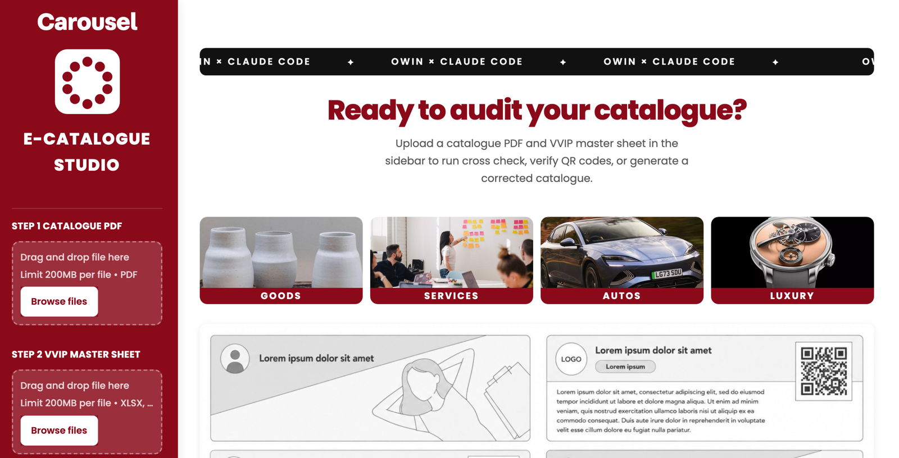

# VVIP Catalogue Studio

One app, three features, for maintaining Carousell VVIP merchant e-catalogues.




## Setup

Requires Python 3.10+.

```bash
git clone https://github.com/<your-username>/vvip-catalogue-studio.git
cd vvip-catalogue-studio
python3 -m venv .venv
source .venv/bin/activate          # Windows: .venv\Scripts\activate
pip install -r requirements.txt
playwright install chromium        # one-time, for QR live-verify + profile fetch
streamlit run app.py
```

This opens the app in your browser at `http://localhost:8501`. Everything runs on
your own machine, and uploaded PDFs and sheets never leave your computer.

### Optional: AI-written merchant descriptions

Without any configuration, cards use a generic description. To turn on AI
descriptions, point the app at an AI provider. It works with any of several:
Ollama Cloud, a local Ollama install, Google Gemini, or any service that exposes
an OpenAI-compatible chat API. "OpenAI-compatible" refers to the request format,
which is a common standard; it does not mean you need OpenAI itself. Pick a free
option and set it with environment variables:

```bash
# Ollama Cloud (free tier). Key from ollama.com/settings/keys
export AI_BASE_URL=https://ollama.com/v1
export AI_API_KEY=<your-ollama-key>
export AI_MODEL=minimax-m3          # free and fast; nemotron-3-super is also free
                                    # (most other cloud models need a paid plan)

# Local Ollama (free, offline). Run `ollama serve` and `ollama pull llama3.2`
export AI_BASE_URL=http://localhost:11434/v1
export AI_MODEL=llama3.2            # no key needed

# Google Gemini (free tier). Key from aistudio.google.com/app/apikey
export AI_BASE_URL=https://generativelanguage.googleapis.com/v1beta/openai/
export AI_API_KEY=<your-gemini-key>
export AI_MODEL=gemini-1.5-flash
```

If the primary model errors or hits a free-tier limit, descriptions automatically
retry with `AI_FALLBACK_MODEL` (default `nemotron-3-super`).

Load a **catalogue PDF** and the **VVIP master sheet**, then work through three tabs.

## The three features

1. **Cross-check.** For every merchant, is it in the catalogue and is it still a
   VVIP (in the sheet)?
   - in catalogue and VVIP: **keep**
   - in catalogue but not VVIP: **remove** (dropped from VVIP)
   - VVIP but not in catalogue: **add** (missing VVIP)
   - Handle matching is fuzzy. The sheet often stores a business name that derives
     to a short stem such as `acmebrand`, while the catalogue shows the fuller
     handle `acmebrandsg`. A prefix match bridges the two. (Handles shown here are
     placeholders, not real merchants.)

2. **QR check.** Decode every QR and prove it is trustworthy:
   - decodes to the printed handle (otherwise *mismatch*)
   - resolves to a live profile (otherwise *dead*)
   - lands on the right merchant, not a renamed account (*renamed*) or a blank
     shell that loads but is not the profile (*soft-404*)
   - missing QR is flagged *no-qr*

3. **Generate.** Apply the approved changes and render the corrected next edition,
   where `final = in-catalogue VVIPs - approved removals + approved additions`.
   Every card is rebuilt fresh (profile, description, and a brand-new QR from the
   canonical URL), so every broken QR is fixed by construction. Dead profiles are
   skipped and reported.

Changes from features 1 and 2 are proposed. You approve them with checkboxes, and
only then does Generate apply them.

## Architecture

```
app.py                 Streamlit UI, 3 tabs, session-state driven
studio/
  sources.py           single wiring point to the two engine packages (lazy
                       imports for the heavy native/browser entry points)
  state.py             StudioSession, MerchantRecord, ProposedChange
  crosscheck.py        Feature 1 (extract + master diff), in-process
  qr.py                Feature 2 (decode-match + live + soft-404), threaded
  generate.py          Feature 3 (apply approved changes + render), threaded
  runner.py            run a Playwright stage on a background thread
```

Engines reused as-is (vendored at the repo root, not external packages):
- **qrcheck/** for PDF extraction, master ingest, and live verify
- **catbuilder/** for profile fetch, describe, QR gen, and PDF render

## Testing and quality

Run the test suite (network-free unit tests over the critical paths: SSRF guard,
handle and URL normalization, QR verdict logic, master ingest, cross-check,
descriptions, and the `.env` loader):

```bash
pip install -r requirements-dev.txt
pytest
```

CI runs the same suite on every push and pull request to `main`
(`.github/workflows/ci.yml`), and a red suite blocks the change. The project keeps
a lightweight ISO 9001-aligned quality system under `docs/`:

- [docs/QUALITY.md](docs/QUALITY.md) for the quality policy, measurable objectives, and release process
- [docs/REQUIREMENTS.md](docs/REQUIREMENTS.md) for requirements and acceptance criteria, traced to tests
- [docs/NONCONFORMITY_LOG.md](docs/NONCONFORMITY_LOG.md) for the defect and corrective-action log

The Playwright-backed stages (live QR check, profile fetch) run on a background
thread inside the Streamlit process. Sync Playwright cannot `start()` on a thread
that already has a running asyncio loop, so a fresh thread sidesteps it. No
subprocess required.

## Notes and environment

- **AI descriptions** need an AI provider configured with `AI_BASE_URL`,
  `AI_API_KEY`, and `AI_MODEL` (see the options above). Without one, cards get a
  generic description and the toggle is disabled.
- **macOS sandbox:** if launched in a restricted sandbox, files under `~/Downloads`
  and `~/Library/CloudStorage` may be unreadable. The app prefers
  `/tmp/qrcheck_master.xlsx` and `/tmp/qrcheck_archive/*.pdf`, so stage copies there
  if needed.
- The master sheet stores business names, so the **add** list can contain noisy
  derived handles. Review and uncheck junk before generating (dead ones are skipped
  anyway).
- Profile, avatar, and QR assets are cached under `/tmp/catbuilder_cache` (shared
  with catbuilder).
